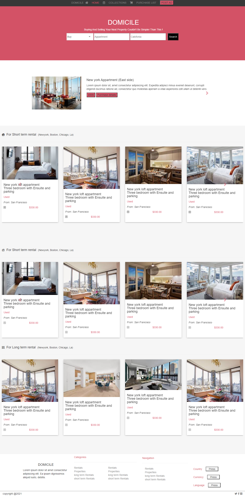
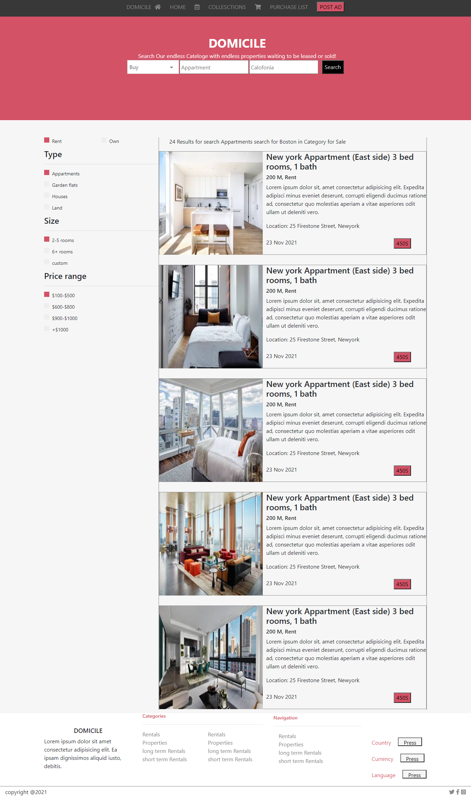

# Capstone Project - ZATTIC online store

> Capstone projects are solo projects at the end of the each of the Microverse Main Technical Curriculum section. 

The project is to build an online store website and I opted to build one that showcases properties for sale and rent. It has two pages.
- The Home page
- The Search page

As per the requirements and instructions Each of these pages have versions for 2 different screen sizes: 

- mobile: up to 768px
- desktop: from 768px

## Built With

- HTML
- BootStrap
- CSS

## Live Demo

[Live Demo Link](https://stephanie041996.github.io/Capstone1/)

## Getting Started

To get a local copy up and running follow these simple example steps.

Clone directory using GitHub. 

You can run by opening the file in your browser as well!

Live preview available at Link

### Run tests

- Run npx hint ." to check errors on HTML
- Run npx stylelint "**/*.{css,scss}" to check errors on the CSS

## Authors

👤 **Author1**

GitHub: @stephanie041996
LinkedIn: [linkedin](https://www.linkedin.com/in/stephanie-sakuhuni-a81029140/)
👤 Author Stephanie Sakuhuni

## 🤝 Contributing

Contributions, issues, and feature requests are welcome!

Feel free to check the [issues page](https://github.com/Stephanie041996/Capstone1/issues).

## Show your support

Give a ⭐️ if you like this project!

## Acknowledgments

- [Mohammed Awad](https://www.behance.net/gallery/24796463/ZATTIX)

## 📝 License

This project is [Microverse](https://microverse.org) licensed.
